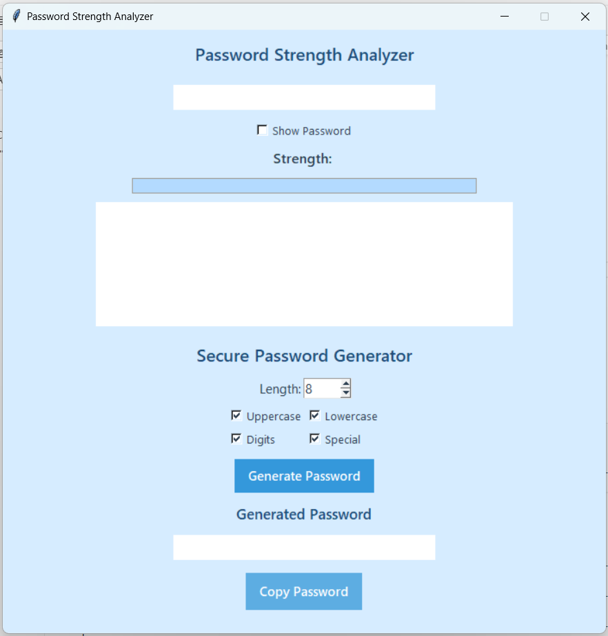

# 🔐 Password Strength Analyzer and Generator

The Password Strength Analyzer and Generator is a Python-based GUI application designed to enhance user security by evaluating and generating strong passwords. The tool analyzes user-entered passwords in real time using multiple validation criteria such as length, uppercase and lowercase characters, digits, special symbols, repeated characters, and common password detection.

It provides visual feedback through a strength indicator and checklist system, helping users understand how secure their passwords are and how they can improve them.

In addition, the application includes a secure password generator that creates strong, random passwords based on best security practices. The generated password is displayed in a protected, read-only field and can be copied to the clipboard using a dedicated button.

Built using Python and Tkinter, the project focuses on usability, security awareness, and clean interface design.

## ✨ Features

- Real-time password strength analysis
- Visual strength meter (progress bar)
- Checklist validation system
- Secure custom password generator
- Read-only generated password display
- Copy-to-clipboard functionality
- Clean light-themed UI

---

## 🧠 Password Evaluation Criteria

- Minimum 8 characters
- Uppercase & lowercase letters
- Digits
- Special characters
- Not a common password
- No repeated characters (e.g., aaa)

---

## ⚙️ Tech Stack

- Python
- Tkinter
- Regex
- Random & String modules

---

## 📸 App Preview



---

## 🚀 How to Run

```bash
python password_analyzer_generator.py
